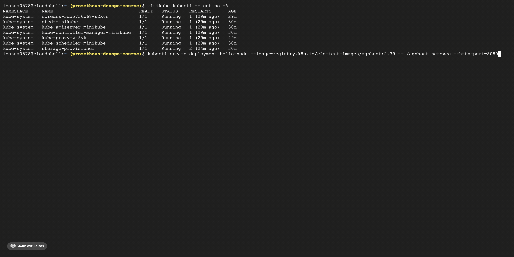
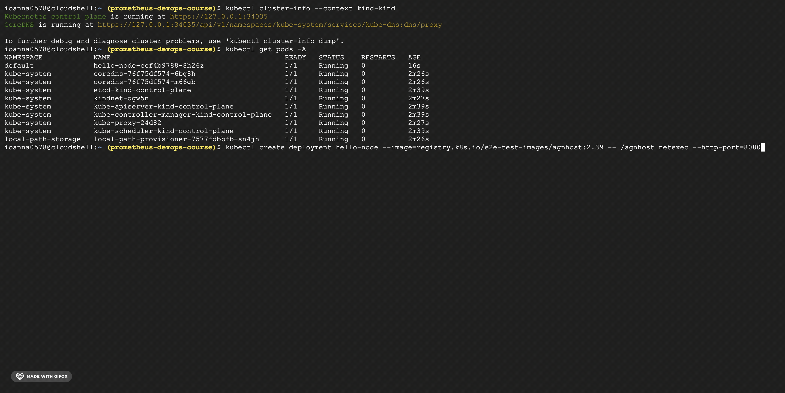

# Description of tools and their purposes.

## Minikube:
### Description: 
Minikube is a tool that allows you to run a single-node Kubernetes cluster on your local machine. It creates a virtual machine (VM) using a hypervisor (such as VirtualBox) and deploys Kubernetes on that VM.
### Advantages:
Provides a full Kubernetes experience for local development and testing.
Widely used with extensive documentation and community support.
Supports multiple hypervisors, making it versatile.
### Disadvantages:
Requires a hypervisor for VM-based setup, which can be resource-intensive.
Limited scalability due to its single-node architecture.
May require additional configuration for network access.

## KinD (Kubernetes in Docker):
### Description:
KinD allows you to run a Kubernetes cluster using Docker containers as nodes. It creates lightweight, isolated Kubernetes clusters suitable for local development and testing.
### Advantages:
Lightweight and easy to set up, leveraging Docker's native integration.
Resource-efficient compared to VM-based solutions like Minikube.
Suitable for local development environments, with growing community support.
### Disadvantages:
Limited to local development environments, as it doesn't support multi-node clusters by default.

## k3d (Kubernetes in Docker):
### Description: 
k3d is another tool for running Kubernetes clusters using Docker containers. It's designed to be lightweight and fast, with a focus on simplicity and ease of use.
### Advantages:
Lightweight and fast, making it suitable for local development and testing.
Provides a simple setup and usage experience.
Good for local development and testing scenarios.
### Disadvantages:
Like KinD, it's limited to local development environments and doesn't support multi-node clusters out of the box.
Overall, Minikube is suitable for users who need a full Kubernetes experience on their local machine and can afford the resource overhead of a VM. KinD and k3d are better suited for users who prioritize lightweight solutions and simplicity, especially for local development and testing purposes.
## Comparison table

| Characteristic                         | Minikube                                                               | KinD                                         | k3d                                        |
|----------------------------------------|------------------------------------------------------------------------|----------------------------------------------|--------------------------------------------|
| **Architecture Support**               | Supports multiple architectures (x86, x64, ARM)                       | Supports all architectures                   | Supports all architectures                |
| **System Requirements**                | - Adequate RAM and CPU resources for running a virtual machine (typically 2 CPU cores and 2GB RAM minimum, but more may be needed for larger workloads). - Hypervisor software installed and properly configured (e.g., VirtualBox, Hyper-V, KVM). - Compatible operating system (Windows, macOS, Linux) with virtualization support enabled. - Adequate disk space for VM images and Kubernetes binaries. - Network connectivity for downloading Kubernetes images and accessing the cluster. | - Docker Engine installed and properly configured on the host machine. - Adequate RAM and CPU resources for running Docker containers (typically 2 CPU cores and 2GB RAM minimum, but more may be needed for larger workloads). - Docker Compose installed (optional but recommended for managing multi-node clusters). - Adequate disk space for Docker images and Kubernetes binaries. - Network connectivity for downloading Kubernetes images and accessing the cluster. | - Docker Engine installed and properly configured on the host machine. - Adequate RAM and CPU resources for running Docker containers (typically 2 CPU cores and 2GB RAM minimum, but more may be needed for larger workloads). - Docker Compose installed (optional but recommended for managing multi-node clusters). - Adequate disk space for Docker images and Kubernetes binaries. - Network connectivity for downloading Kubernetes images and accessing the cluster. |
| **Operating System Support**           | Supports multiple operating systems (Windows, macOS, Linux)           | Supports all operating systems              | Supports all operating systems            |
| **Automation Possibility**             | Supports automation through scripts and configuration files           | Supports automation through scripts         | Supports automation through scripts       |
| **Additional Functions**               | - Monitoring through addons like Dashboard, Prometheus                | - Monitoring through addons like Metrics Server, Prometheus | - Monitoring through addons like Grafana, Prometheus |
|                                        | - Maintenance through addons like Helm                                | - Maintenance through addons like Helm     | - Maintenance through addons like Rancher |                             
| **Shortcomings**                       | - Requires hypervisor for VM-based setup                              | - Limited to local development environments | - Limited to local development environments |
|                                        | - Resource-intensive due to VM                                        |                                              |                                            |
|                                        | - May require additional configuration for network access             |                                              |                                            |
|                                        | - Limited support for persistent volumes                              |                                              |                                            |
| **Deployment**             | Single-node Kubernetes cluster              | Multi-node Kubernetes cluster               | Multi-node Kubernetes cluster               |
| **Installation**           | Requires a hypervisor (e.g., VirtualBox)    | Docker and kubectl                          | Docker and kubectl                          |
| **Ease of Use**            | Easy to install and use, suitable for local development | Simple setup and usage                     | Simple setup and usage                     |
| **Resource Consumption**   | Consumes more system resources due to VM    | Lightweight, less resource-intensive       | Lightweight, less resource-intensive       |
| **Isolation**              | Provides isolation with VM                  | Uses Docker containers for isolation        | Uses Docker containers for isolation        |
| **Scalability**            | Limited scalability due to single-node architecture | Scalable with multiple nodes               | Scalable with multiple nodes               |
| **Network Configuration**  | May require additional configuration for network access | Automatically configures networking        | Automatically configures networking        |
| **Persistent Volumes**     | Supports persistent volumes                 | Limited support for persistent volumes     | Limited support for persistent volumes     |
| **Development Workflow**   | Suitable for local development and testing  | Suitable for local development and testing  | Suitable for local development and testing  |
| **Community Support**      | Widely used with strong community support   | Growing community support                   | Growing community support                   |
| **Ecosystem Compatibility** | Compatible with various Kubernetes addons and tools | Compatible with various Kubernetes addons and tools | Compatible with various Kubernetes addons and tools |
| **Advantages**             | - Full Kubernetes experience               | - Easy setup with Docker                    | - Lightweight and fast                      |
|                        | - Widely used with extensive documentation | - Lightweight and resource-efficient       | - Simple setup and usage                    |
|                        | - Supports multiple hypervisors            | - Native Docker integration                 | - Good for local development and testing    |
| **Disadvantages**          | - Requires a hypervisor for VM-based setup | - Limited to local development environments | - Limited to local development environments |

