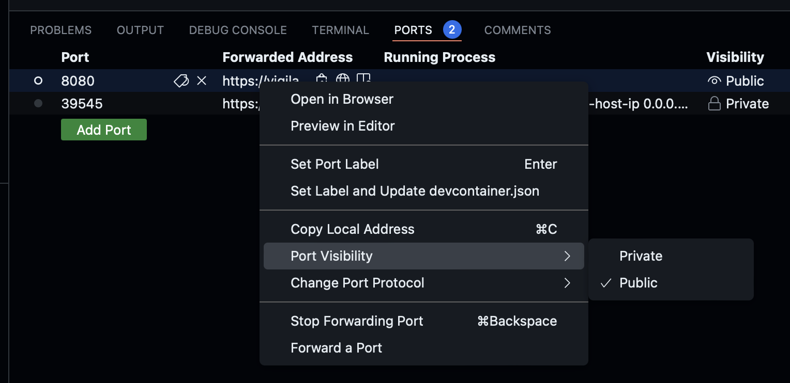
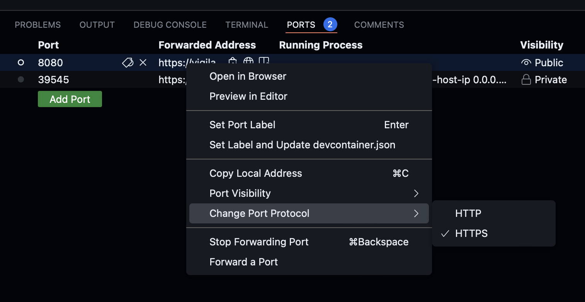

# How to use ArgoCD

## ArgoCD GUI
1. Go to Github and launch `k3d-demo-cluster`
2. Open terminal and paste `kubectl port-forward svc/argocd-server -n argocd 8080:443`
3. Go to PORTS and change `Port visibility - Public` / `Change Port Protocol - HTTPS`

4. Press `Open in browser button`
5. Enter your ArgoCD login and password

## AgoCD CLI
1. Go to Github and launch `k3d-demo-cluster`
2. Open terminal and install ArgoCD CLI `brew install argocd`
3. Login to your account using command `argocd login`
